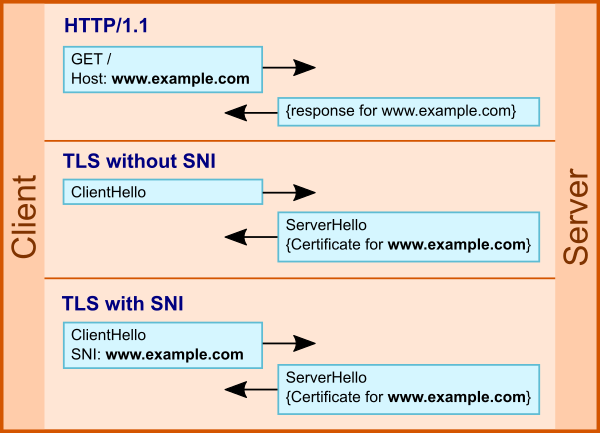

# Механизм работы Server Name Indication (SNI) и Encrypted SNI в TLS протоколах

## Введение

### Глоссарий

- **TLS (Transport Layer Security )** - криптографический протокол, обеспечивающий безопасность передачи данных между узлами в сети, TLS служит основой для безопасность таких протоколов как HTTPS, FTPS и SMTPS. Является прямым наслдеником протокола SSL.
- **SNI (Server Name Indication)** - расширение TLS протокола с помощью которого сервера могут хостить несколько ресурсов с использованием одного IP адреса.
- **DNS-сервер** - сервер, который выполняет функцию преобразования доменных имен в соответствующие IP-адреса и наоборот (формально DNS сервер обладает большим функционалом, как минимум отвечает на рекурсивные и итеративные DNS запросы, но в контексте данной темы данного определения достаточно).
- **Шифрование с открытым ключом** - метод шифрования в котором используется два ключа шифрования - открытый и закрытый, для шифрований и расшифровки данных соотвественно. Ключи сгенерированны таким образом, чтобы знаю один из них не было возможности получить другой за разумное время, также обеспечивается надежный метод шифрования сообщений: сообщение зашифрованное открытым ключем можно расшифровать только соотвествующим ему закрытым ключом.
- **Алгоритм обмена ключами Диффи — Хеллмана** - это криптографический протокол, который позволяет двум сторонам (например, клиенту и серверу) согласовать общий секретный ключ через незащищенный канал связи. Суть протокола заключается в том, что обе стороны могут сгенерировать свои секретные ключи и обменяться публичными ключами безопасным способом. Затем они используют полученные публичные ключи и свои собственные секретные ключи для вычисления общего секретного ключа, который никому не известен, кроме них двоих.

### SNI и TLS

Если TSL не нуждается в детальных разъяснениях: достаточно считать что это протокол ассимитрично шифрующий данные в сети, то SNI имеет смысл рассмотреть подробнее. Мотивировка к его появлению следующая: во времена HTTP каждый сервер мог хостить только один веб-сайт на своем IP адресе, но при эволюции протоколов и появлении виртуальных хостов встала проблема, как определить серверу, к какому именно из хостов нужно подключить клиента. SNI решает эту проблему: при *TLS рукопожатии* в сообщение *ClientHello* передается имя хоста, по котором сервер однозначно определяет, какой ресурс выдать клиенту. Поэтому SNI играет ключевую роль в обеспечении возможности хостинга нескольких веб-сайтов на одном IP адресе.

## SNI и безопасность

Можно сказать, что безопасность и защита трафика не то, что казалось важным на заре интернета, первые протоколы были сделаны без какого либо шифрования и прочего обеспечения безопасности, потом появились отдельные протоколы (TLS/SSL), поверх которых передается уже зашифрованный трафик. В итоге у нас есть наложение протоколов, и несколько потенциальных дыр в безопасности. Например, доступный SNI открывает возможность *активного сканирования*, DNS атак и возможность создания фишинговых сайтов. Но как же зашифровать SNI? Ведь он передается в привественном сообщение, еще до установления защищенного соединения, до версии TLS 1.3 ответ на этот вопрос был - никак. Но сейчас уже есть ряд методов решения проблемы и мы разберем *Encrypted SNI*.

## ESNI

Как решение мы должны получить надежно зашифрованный индикатор имени сервера, но каким требованиям оно должно соотвествовать и с какими проблемами мы можем столкнуться?

- Надежное шифрование. Очевидно что мы должны иметь два ключа, потому что мы не можем без создания дополнительных протоколов безопасности передвать открытый ключ => наш выбор *ассмитричное шифрование*, где открытый ключ мы получаем со спомогательного сервера (какого?), а уже на целовом сервере расшифровываем с помощью закрытого ключа. Грубо говоря, реализована маленькая модель TLS протокола, но тем не менее полностью корректная с точки зрения безопасности.
- Невозможность доступа к целевому серверу, так как *TLS сертификат* еще не может быть получен. Мы определились, что используем шифрование с открытым ключом, но откуда нам получить эти ключи, очевидно, что передавать ключи от сервера (где хостится сайт, который мы хотим посетить) к клиенту мы не можем, поэтому мы должны воспользоваться другим инструментов и на помощь приходит DNS сервер (в предыдущем пункте мы обозвали его вспомогательным)!  

Решение использовать DNS сервер крайне логично, так как любой доступ к веб-ресурсу начинается с 3х шагов: разрешение доменного имени, установление TCP соединения, TLS рукопожатие, именно в таком порядке. Но получить шифрованный SNI мы должны строго до TLS приветсвия, поэтому единственно возможный вариант - взаимодействовать с DNS сервером.

### Как это реализовано по шагам?

Если при использовании обычного SNI мы получаем примерно такую схему подключения:

1. Используя ESNI, на этапе разрешения доменного имени в IP адрес, клиент получает открытый ключ сервера. Этот ключ заранее был опубликован на DNS сервере.
2. Клиент и сервер используют протокол Диффи-Хеллмана для создания общего секрета. Затем этот общий секрет используется для генерации симметричного ключа шифрования.
3. После шифрования симметричным ключем SNI, клиент отправляет зашифрованный ESNI (Encrypted SNI) вместе с другой криптографической информацией на сервер.
4. Получив ESNI, сервер использует свой закрытый ключ для расшифровки сообщения и извлечения SNI. После этого сервер может принять решение о том, как обрабатывать запрос и предоставить доступ к запрашиваемому ресурсу.

## NB

Мы много говорили про безопасность: про ассмитричное шифрование, про специальные протоколы безопасной передачи ключей и т.д., но какой от этого смысл, если передача информации через DNS по умолчанию не шифруется, тогда вся цепочка скомпрометирована? Не совсем.

С появлением *DNS over TLS (DoT)*, а также *DNS over HTTPS (DoH)*, DNS запросы могут шифроваться, что впрочем не спасает от уязвимости *DNS cache poisoning*, когда мы можем подменить ответы на запросы, имея доступ к авторитетному DNS серверу. Поэтому на данный момент стандартной связкой является **ESNI + DNSSEC**, когда каждый DNS-ответ аутентифицирован специальной подписью, тем самым злоумышленники лишены возможности внедрять вредоносные данные в кеш.
